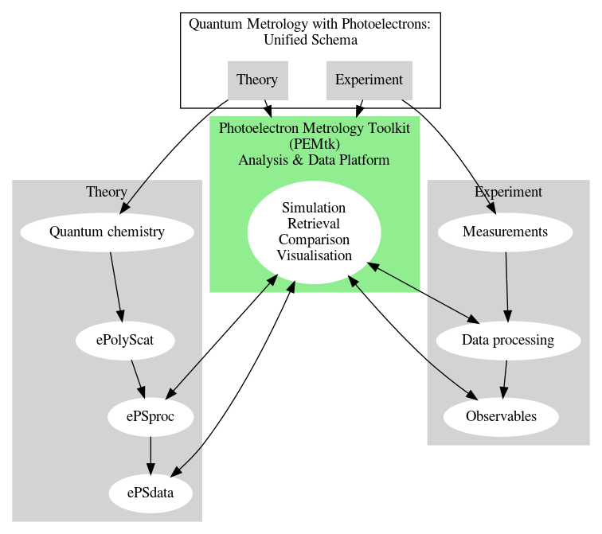

PEMtk: the Photoelectron Metrology Toolkit
==========================================

(aka Quantum Metrology with Photoelectrons platform data & analysis
layer)

The unifiying layer (glue) for the platform - details to follow soon.

For now, see `ePSdata for general aims &
motivation <https://phockett.github.io/ePSdata/about.html#Motivation>`__.

   QM Platform schematic
